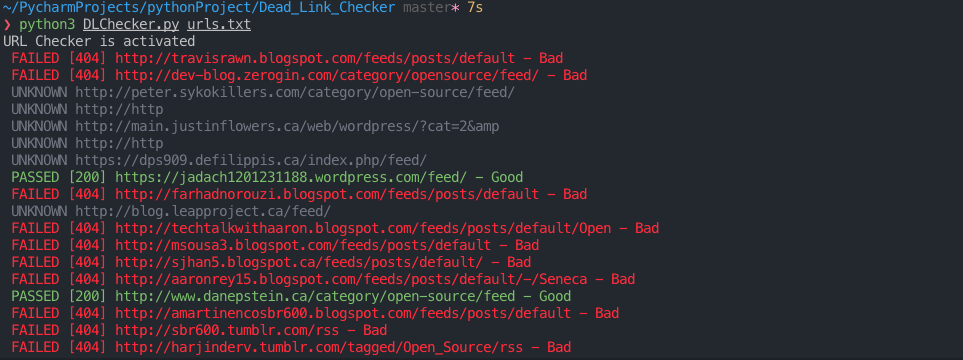
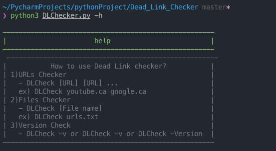

# Dead_Link_Checker
## RELEASES
### [Dead Link Checker (Release 0.1)](https://github.com/sonechca/Dead_Link_Checker)
<p align="center">
  
</p>

## About DLChecker
This repository is a command-line tool to find and report a dead URL status in a file. This tool can help users to check the broken link and show the list of broken links.

### Features
 - Searching for the URLs in the input files
 - Checking multiple URLs by typing URL in the command line
 - Organizing links each working and broken URLs
 - Providing [Help] option to show users how to use this tool
 - Showing unknown URLs which have status code(not 200 and 400~599), error, or long loading (1.5 seconds timeout)

### Optional Features
 - Starting an argument with -v/-V can be supplied to the program for current version information.
 - Printing good status[200] URLs with green colour and bad status[400,404] URLs with red colour
## Getting Started
 
  1. Clone the repo
  
  ```bash
  git clone https://github.com/sonechca/Dead_Link_Checker.git
  ```
  
  2. The DLChecker file in the DEAD_LINK_CHECKER folder on the command line
  
  ```bash
  cd DEAD_LINK_CHECKER
  ```
  3. Install library
  ```bash
  pip3 install requests
  pip3 install coloarama
  ```
  4. DLChecker run command
  ```bash
  python3 DLChecker.py <filename> or <URL>
  ```
## Help/Usage
 Users can call the help/usage box if they do not know how to use this tool.
 ```bash
 python3 DLChecker.py (blank) or python3 DLChecker.py -h/-H
 ```
 <p align="center">
  
</p>

## Library
 - [Requests](https://requests.readthedocs.io/en/master/)
	 - Requests is an elegant and simple HTTP library for Python, built for human beings.
     - Requests allows you to send HTTP/1.1 requests extremely easily.
     - User can check the response status code
     ```bash
        >>> r = requests.get('https://httpbin.org/get')
        >>> r.status_code
        200
     ```

## Issues
 - Colouring in CMD not work #1
 - Use the correct python way when checking for empty/non-empty lists #2
 - The current version of the tool cannot read the redirect status code(303, 308). The tool is recognizing that redirect is an error exception
 - After the install of requests. I think you should include another line reminding the user to also download:
"Pip3 install colorama"

## Solution
 - Adding the colorama library to fix error. I used function that contain gray color code to use for unknown URL. Colorama library does not have gray color
 - I fixed the condition code to check links list and dead_links list
 - I added the comment of installation
